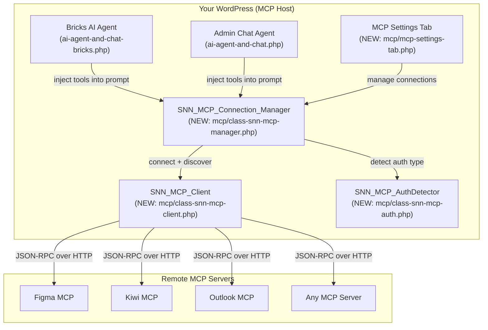

# MCP Connections — Implementation Plan

> **Status:** Plan Locked — Ready to Build  
> **Goal:** Connect any MCP server to your AI agents by just pasting a URL + token  
> **Method:** Zero-dependency PHP MCP client built from Anthropic's spec — 1 file, ~300 lines  
> **UX:** Paste URL → auto-detect auth type → test/debug log → tools discovered → AI uses them

---

## 1. What MCP Is & Why It Matters

MCP (Model Context Protocol) is an open standard by **Anthropic** for connecting AI applications to external tools and data sources. Think of it as **"USB-C for AI"** — one universal connector for any tool.

A single MCP server exposes **tools** (callable functions), **resources** (readable data), and **prompts** (templates) through a standardized JSON-RPC 2.0 interface over HTTP.

| MCP Server | Example Tools You'd Get |
|-----------|------------------------|
| **Figma MCP** | `get_file`, `get_node`, `export_image`, `list_projects` |
| **Kiwi MCP** | `browser_navigate`, `browser_screenshot`, `browser_click` |
| **Outlook MCP** | `send_email`, `read_messages`, `create_event` |
| **GitHub MCP** | `create_issue`, `read_file`, `create_pr`, `search_code` |
| **Slack MCP** | `send_message`, `list_channels`, `get_thread` |
| **Any server** | Whatever tools it exposes — auto-discovered |

---

## 2. The Protocol — 3 JSON-RPC Calls, That's It

MCP over Streamable HTTP is **exactly** three JSON-RPC 2.0 calls. No magic:

```
┌──────────────────────────────────────────────────────────────┐
│ 1. INITIALIZE (Handshake + Capability Negotiation)           │
│                                                              │
│ POST /mcp                                                    │
│ {                                                            │
│   "jsonrpc": "2.0",                                         │
│   "method": "initialize",                                   │
│   "params": {                                               │
│     "protocolVersion": "2025-06-18",                        │
│     "capabilities": {"tools": {"listChanged": true}},       │
│     "clientInfo": {"name": "SNN_AI", "version": "1.0"}     │
│   }                                                         │
│ }                                                            │
│                                                              │
│ ← Server returns capabilities + Mcp-Session-Id header       │
│ ← Then send: {"method": "notifications/initialized"}        │
└────────────────────────┬─────────────────────────────────────┘
                         ↓
┌──────────────────────────────────────────────────────────────┐
│ 2. DISCOVER (tools/list)                                     │
│                                                              │
│ POST /mcp                                                    │
│ Mcp-Session-Id: abc123                                       │
│ {"jsonrpc":"2.0","method":"tools/list"}                     │
│                                                              │
│ ← Server returns array of tool definitions with schemas     │
│   [{name, title, description, inputSchema, outputSchema}]   │
└────────────────────────┬─────────────────────────────────────┘
                         ↓
┌──────────────────────────────────────────────────────────────┐
│ 3. EXECUTE (tools/call)                                      │
│                                                              │
│ POST /mcp                                                    │
│ Mcp-Session-Id: abc123                                       │
│ {"jsonrpc":"2.0","method":"tools/call",                     │
│  "params":{"name":"get_design","arguments":{...}}}          │
│                                                              │
│ ← {"result":{"content":[{"type":"text","text":"..."}]}}     │
└──────────────────────────────────────────────────────────────┘
```

**Auth is just an HTTP header.** `Authorization: Bearer xxx` or `X-API-Key: xxx`. Sent on every request alongside `Mcp-Session-Id`.

---

## 3. Architecture — How It Fits Into Your System



---

## 4. Files to Create

```
includes/ai/
├── mcp/
│   ├── class-snn-mcp-client.php        # Zero-dependency MCP client (~300 lines)
│   ├── class-snn-mcp-exception.php     # Typed exceptions
│   ├── class-snn-mcp-manager.php       # Connection manager + tool aggregator
│   ├── class-snn-mcp-auth.php          # Auth-agnostic detector + OAuth handler
│   ├── class-snn-mcp-crypto.php        # Encrypt/decrypt auth values at rest
│   ├── mcp-settings-tab.php            # Admin settings tab UI + JS
│   └── mcp-ajax-handlers.php           # AJAX handlers (test, save, delete, oauth callback)
```

---

## 5. Core Class: `SNN_MCP_Client` — The Protocol Engine

Zero dependencies. Uses only WordPress's built-in `wp_remote_post()`.

```php
class SNN_MCP_Client {
    private string $url;
    private array  $headers = [];
    private ?string $session_id = null;
    private string $protocol_version = '2025-06-18';
    private int    $request_id = 0;
    private int    $timeout = 30;
    private $server_info = null;
    private $capabilities = null;

    // ── Construction ──────────────────────────
    public function __construct(string $url, ?string $authValue = null,
        string $authType = 'bearer', string $customHeaderName = 'X-API-Key');
    public function addHeader(string $name, string $value): self;
    public function setTimeout(int $seconds): self;

    // ── Core JSON-RPC transport ───────────────
    private function send(string $method, array $params = []);
    private function sendWithSessionCapture(string $method, array $params = []);

    // ── MCP Lifecycle ─────────────────────────
    public function initialize(array $clientCapabilities = []): object;
    public function sendNotification(string $method, array $params = []): void;
    public function ping(): bool;

    // ── Tool Discovery ────────────────────────
    public function listTools(?string $cursor = null): array;
    public function listResources(?string $cursor = null): array;
    public function listPrompts(?string $cursor = null): array;

    // ── Tool Execution ────────────────────────
    public function callTool(string $name, array $arguments = []): object;

    // ── Resource Access ───────────────────────
    public function readResource(string $uri): object;
    public function getPrompt(string $name, array $arguments = []): object;

    // ── Helpers ───────────────────────────────
    public function getAllToolsFormatted(string $connectionName): array;
    public static function extractTextResult(object $result): string;
    public function hasTools(): bool;
    public function isReady(): bool;
    public function getServerInfo();
    public function getCapabilities();
}
```

### How `send()` Works Internally

```php
private function send(string $method, array $params = []) {
    $body = [
        'jsonrpc' => '2.0',
        'id'      => 'snn_' . (++$this->request_id),
        'method'  => $method,
        'params'  => (object) $params,
    ];

    $headers = $this->headers;
    if ($this->session_id) {
        $headers['Mcp-Session-Id'] = $this->session_id;
    }

    $response = wp_remote_post($this->url, [
        'headers' => $headers,
        'body'    => wp_json_encode($body),
        'timeout' => $this->timeout,
    ]);

    // → Check wp_error → Check HTTP code → Parse JSON → Check JSON-RPC error
    // → Return result or throw SNN_MCP_Exception with typed error
}
```

### Session Lifecycle (Auto-Handled)

```
First initialize() call:
  → Sends initialize request
  → Captures Mcp-Session-Id from response headers
  → Sends notifications/initialized
  → Session established

All subsequent calls:
  → Include Mcp-Session-Id header automatically
  → If server returns 404 (session expired):
      → Re-initialize with same credentials
      → Retry the original request

static getValidToken() for OAuth:
  → Checks token_expires_at
  → If expired, uses refresh_token to get new access token
  → Saves new tokens encrypted
  → Returns fresh access token
```

---

## 6. Auth-Agnostic Detection — `SNN_MCP_AuthDetector`

Probes the server WITHOUT credentials to determine what auth is needed.

```php
class SNN_MCP_AuthDetector {
    const AUTH_NONE         = 'none';         // Public server
    const AUTH_STATIC_TOKEN = 'static_token'; // API key / Bearer token
    const AUTH_OAUTH_URL    = 'oauth_url';    // Click-to-authenticate
    const AUTH_CUSTOM       = 'custom';       // Manual header setup

    public static function detect(string $url, int $timeout = 10): array {
        // Returns: { mode, message, auth_url, scopes, raw_response }
    }
}
```

### Detection Logic

```
Send initialize WITHOUT any auth headers
    │
    ├─ HTTP 200 + valid InitializeResult → AUTH_NONE (public server)
    │
    ├─ HTTP 200 + result.auth object → AUTH_OAUTH_URL
    │   { "result": { "auth": { "authUrl": "...", "scopes": [...] } } }
    │
    ├─ HTTP 401/403 + error.data.authUrl → AUTH_OAUTH_URL
    │   { "error": { "data": { "authUrl": "..." } } }
    │
    ├─ HTTP 401/403 + no authUrl → AUTH_STATIC_TOKEN
    │
    ├─ Transport error → AUTH_CUSTOM (cannot reach)
    │
    └─ Anything else → AUTH_CUSTOM (unknown, manual)
```

---

## 7. Connection Data Structure

Stored in WordPress option `snn_mcp_connections`:

```php
[
    'id'              => 'conn_a1b2c3d4',      // Unique connection ID
    'name'            => 'Figma Design',        // User-friendly label
    'enabled'         => true,                  // On/off toggle
    'url'             => 'https://figma-mcp.example.com/mcp',

    // ── Auth (one of these patterns) ────────
    'auth_type'       => 'bearer',              // 'none'|'bearer'|'api_key'|'oauth2'
    'auth_value'      => 'encrypted:...',       // Encrypted token/key

    // ── For api_key type ────────────────────
    'custom_header_name' => 'X-API-Key',        // Header name for API keys

    // ── For oauth2 type ─────────────────────
    'refresh_token'     => 'encrypted:...',     // Encrypted refresh token
    'token_expires_at'  => 1719500000,          // Unix timestamp
    'oauth_client_id'   => '...',               // OAuth client ID
    'oauth_client_secret'=> 'encrypted:...',    // Encrypted client secret
    'auth_complete'     => true,                // OAuth flow completed?

    // ── Extra ───────────────────────────────
    'extra_headers'   => [                      // Custom HTTP headers
        ['name' => 'X-Team-ID', 'value' => 'team_123']
    ],
    'timeout'         => 30,                    // Request timeout seconds
    'description'     => '',                    // Optional note
    'tools_cache'     => [...],                 // Last known tool list
    'last_sync'       => '2026-06-27T10:00:00Z',// Last discovery timestamp
]
```

### Encryption (At Rest)

```php
class SNN_MCP_Crypto {
    // Uses WordPress salts + sodium_crypto_secretbox
    public static function encrypt(string $value): string;
    public static function decrypt(string $encrypted): string;
}
```

Auth values are **never** sent to the browser. They stay in PHP, encrypted with WordPress salts. The settings page only receives `encrypted:...` placeholders. When saving, the value is encrypted before storage. When used, it's decrypted in-memory for the HTTP request only.

---

## 8. Debug Log Test System

Reuses the exact same color-coded terminal-style log pattern from the existing AI connection test in `ai-settings.php`.

### Test Phases (5 Phases)

```
[INFO]  Connecting to Figma MCP at https://figma-mcp.example.com/mcp
[INFO]  Auth type: Bearer Token (figd_abc...xyz)
[INFO]  ─────────────────────────────────────────────────
[INFO]  PHASE 1: HTTP Connectivity
[INFO]  Sending POST to https://figma-mcp.example.com/mcp
[OK]    Server responded in 127ms (HTTP 200)
[INFO]  ─────────────────────────────────────────────────
[INFO]  PHASE 2: MCP Protocol Handshake (initialize)
[OK]    Protocol version negotiated: 2025-06-18
[OK]    Mcp-Session-Id: a1b2c3d4... (captured)
[INFO]  Server: "Figma MCP Server" v2.1.0
[INFO]  Server capabilities: tools ✓  resources ✓  prompts ✓
[OK]    Initialized notification sent — handshake complete
[INFO]  ─────────────────────────────────────────────────
[INFO]  PHASE 3: Tool Discovery (tools/list)
[OK]    12 tools discovered:
[OK]    • get_file — Fetch a Figma design file by key
[OK]    • get_node — Fetch a specific node from a Figma file
[OK]    • export_image — Export a node as an image
[OK]    ... (9 more)
[INFO]  ─────────────────────────────────────────────────
[INFO]  PHASE 4: Resource Discovery (resources/list)
[OK]    3 resources discovered
[INFO]  ─────────────────────────────────────────────────
[INFO]  PHASE 5: Health Check (ping)
[OK]    Server responded to ping in 8ms
[INFO]  ─────────────────────────────────────────────────
[OK]    ✅ Connection test PASSED! Figma MCP is ready.
```

### Error Scenarios

```
# STATIC TOKEN NEEDED:
[WARN]  Server returned 401 Unauthorized
[INFO]  No OAuth URL provided — this is a STATIC TOKEN server
[INFO]  → Paste your API key from the provider dashboard

# OAUTH CLICK-THROUGH NEEDED:
[WARN]  Server returned 401 with auth URL
[INFO]  OAuth URL: https://provider.com/oauth/authorize?...
[INFO]  Required scopes: tools/read, tools/write
[INFO]  → Click "Authorize with Provider" below

# INVALID KEY:
[ERROR] HTTP 401 Unauthorized
[ERROR] Response: {"error":{"message":"Invalid API key"}}
[ERROR] Tip: Generate a new key from the provider dashboard.

# TIMEOUT:
[ERROR] Connection timed out after 30 seconds
[ERROR] Tip: Verify the URL is correct and the server is reachable.

# PROTOCOL VERSION MISMATCH:
[WARN]  Server rejected protocol version 2025-06-18
[INFO]  Server supports: 2024-11-05
[INFO]  Retrying with protocol version 2024-11-05...
[OK]    Server accepted protocol version 2024-11-05

# NOT AN MCP ENDPOINT:
[ERROR] Received HTML instead of JSON
[ERROR] Raw response: <html><body>404 Not Found</body></html>
[ERROR] Tip: The URL may not be an MCP endpoint. MCP URLs typically end with /mcp.
```

---

## 9. OAuth 2.1 Flow (Click-to-Authenticate)

When the auth detector finds an OAuth server:

```
┌──────────────┐     ┌──────────────┐     ┌──────────────┐
│  WordPress   │     │  MCP Server  │     │  Provider    │
│  (Client)    │     │              │     │  (Auth Site) │
└──────┬───────┘     └──────┬───────┘     └──────┬───────┘
       │                     │                    │
       │  1. initialize (no auth)                 │
       │────────────────────►│                    │
       │                     │                    │
       │  2. 401 + authUrl   │                    │
       │◄────────────────────│                    │
       │                     │                    │
       │  3. Open popup → redirect user           │
       │─────────────────────────────────────────►│
       │                     │                    │
       │  4. User clicks "Allow"                  │
       │                     │                    │
       │  5. Redirect to callback with ?code=     │
       │◄─────────────────────────────────────────│
       │  (admin-ajax.php?action=snn_mcp_oauth_callback)  │
       │                     │                    │
       │  6. Exchange code for tokens             │
       │────────────────────►│                    │
       │                     │                    │
       │  7. {access_token, refresh_token, expires_in}    │
       │◄────────────────────│                    │
       │                     │                    │
       │  8. Save tokens encrypted                │
       │  9. Redirect to settings page (success)  │
```

### Callback URL (Generated Automatically)

```
https://yoursite.com/wp-admin/admin-ajax.php
  ?action=snn_mcp_oauth_callback
  &conn=conn_a1b2c3d4
```

The handler:
1. Receives `?code=xxx&state=yyy`
2. Looks up the connection by ID
3. Exchanges code for tokens via POST to token endpoint
4. Saves encrypted tokens
5. Redirects back to MCP settings with `?auth_success=conn_a1b2c3d4`

### Auto-Refresh (Background)

Every time a token is used, it's checked for expiry (with 60s buffer). If expired, the refresh token is used to get a new access token automatically. If refresh fails, the connection is marked as `auth_complete: false` and the user sees "⚠️ Re-authorization needed" in the settings UI.

---

## 10. AI Agent Integration

### How Tools Reach the AI

```
SNN_MCP_Connection_Manager::getAllTools()
    │
    ├─ Load all enabled connections from wp_options
    ├─ For each connection:
    │   ├─ Create SNN_MCP_Client with decrypted auth
    │   ├─ Initialize (handshake)
    │   ├─ listTools()
    │   └─ Format: {connection, name, description, inputSchema}
    │
    └─ Return merged tool array
```

### Injected Into System Prompt

The tools appear alongside existing WordPress abilities:

```
=== MCP TOOLS (from connected services) ===

Figma Design (figma-mcp.example.com):
  • get_file — Fetch a Figma design file by key
    Parameters: { file_key: string, node_id?: string }
  • export_image — Export a node as an image
    Parameters: { file_key: string, node_id: string, format?: "png"|"svg" }

Outlook (outlook-mcp.example.com):
  • send_email — Send an email via Outlook
    Parameters: { to: string, subject: string, body: string }
  • read_inbox — Read emails from inbox
    Parameters: { folder?: string, limit?: number }
```

### Calling MCP Tools via the Agent

The AI outputs a standard ability JSON block, but with `mcp/call`:

```json
{
  "abilities": [
    {
      "name": "mcp/call",
      "input": {
        "connection": "conn_a1b2c3d4",
        "tool": "get_file",
        "arguments": { "file_key": "abc123xyz" }
      }
    }
  ]
}
```

The ability executor:
1. Validates the connection exists and is enabled
2. Gets an initialized client (with auto-refreshed auth)
3. Calls the tool
4. Returns the result as text content
5. Formats it in the chat response

---

## 11. Settings Tab UI — "MCP Connections"

### Tab Layout

```
┌──────────────────────────────────────────────────────────────┐
│ [AI Settings]  [Prompt Presets]  [MCP Connections]  ← NEW   │
└──────────────────────────────────────────────────────────────┘

┌──────────────────────────────────────────────────────────────┐
│ MCP Connections                                               │
│                                                               │
│ Connect any MCP server by pasting its URL. Your AI agents     │
│ will auto-discover and use its tools.                         │
│                                                               │
│ [+ Add Connection]  [Refresh All Caches]                      │
├──────────────────────────────────────────────────────────────┤
│                                                               │
│ ┌─ Figma Design ─────────────────────────────────────────┐   │
│ │ 🟢 Connected · 12 tools · 34ms         [Test] [Edit]   │   │
│ │ https://figma-mcp.example.com/mcp               [⏻ Off]│   │
│ │                                                        │   │
│ │ ▶ Show Tools (12)                                      │   │
│ │   • get_file — Fetch a Figma design file by key       │   │
│ │   • get_node — Fetch a specific node                   │   │
│ │   • export_image — Export a node as an image           │   │
│ │   ... 9 more                                           │   │
│ └────────────────────────────────────────────────────────┘   │
│                                                               │
│ ┌─ Kiwi Browser ─────────────────────────────────────────┐   │
│ 🔴 Error · 0 tools                       [Test] [Edit]   │   │
│ https://kiwi.example.com/mcp                     [⏻ Off]│   │
│ ▶ Show Error Details                                     │   │
│   [ERROR] Connection timed out after 30s                 │   │
│   [ERROR] Tip: Verify the server is running               │   │
│ └────────────────────────────────────────────────────────┘   │
│                                                               │
│ ┌─ Outlook ──────────────────────────────────────────────┐   │
│ ⚫ Disabled · 0 tools                       [Test] [Edit] │   │
│ https://outlook-mcp.example.com/mcp              [⏻ On]  │   │
│ Enable to discover tools                                  │   │
│ └────────────────────────────────────────────────────────┘   │
│                                                               │
├──────────────────────────────────────────────────────────────┤
│                                                               │
│ ┌─ ADD / EDIT CONNECTION ────────────────────────────────┐   │
│ │                                                        │   │
│ │ Name:    [Figma Design                       ]         │   │
│ │ URL:     [https://figma-mcp.example.com/mcp   ]         │   │
│ │                                                        │   │
│ │ After entering URL → [Detect Auth Requirements]         │   │
│ │                                                        │   │
│ │ ┌─ AUTH DETECTED: Static Token ───────────────────┐   │   │
│ │ │ Auth Type:  [Bearer Token ▼]                    │   │   │
│ │ │ Token:      [••••••••••••••••••••••] (show/hide)│   │   │
│ │ │ Header:     Authorization: Bearer figd_abc...xyz │   │   │
│ │ └─────────────────────────────────────────────────┘   │   │
│ │                                                        │   │
│ │ Extra Headers: [+ Add Header]                          │   │
│ │   X-Team-ID: [team_123] [✕]                           │   │
│ │                                                        │   │
│ │ Timeout:     [30] seconds                              │   │
│ │ Description: [Access Figma designs and asset exports]  │   │
│ │                                                        │   │
│ │ [Test Connection]  [Save Connection]                   │   │
│ │                                                        │   │
│ │ ┌─ Test Results ──────────────────────────────────┐   │   │
│ │ │ ██████████████████████████████████████████████   │   │   │
│ │ │ [INFO]  Connecting to Figma MCP...              │   │   │
│ │ │ [OK]    Server responded in 127ms (HTTP 200)    │   │   │
│ │ │ [OK]    12 tools discovered                     │   │   │
│ │ │ [OK]    ✅ Connection test PASSED!              │   │   │
│ │ │ ██████████████████████████████████████████████   │   │   │
│ │ └─────────────────────────────────────────────────┘   │   │
│ └────────────────────────────────────────────────────────┘   │
└──────────────────────────────────────────────────────────────┘
```

---

## 12. AJAX Handlers

| Action | Purpose |
|--------|---------|
| `snn_mcp_test_connection` | Full 5-phase debug log test with auth detection |
| `snn_mcp_detect_auth` | Lightweight probe to determine auth requirements |
| `snn_mcp_save_connection` | Save/create a connection (encrypts auth values) |
| `snn_mcp_delete_connection` | Remove a connection + its auth data |
| `snn_mcp_toggle_connection` | Enable/disable a connection |
| `snn_mcp_refresh_tools` | Re-discover tools for a specific connection |
| `snn_mcp_refresh_all` | Rediscover tools for all enabled connections |
| `snn_mcp_call_tool` | Proxy a tool call (used by AI agent at runtime) |
| `snn_mcp_oauth_callback` | Catch OAuth redirect after user authorizes |
| `snn_mcp_oauth_start` | Generate OAuth URL and start auth flow |

---

## 13. How It Integrates With Existing Files

### Modified: `ai-settings.php`
- Add third tab button: `<button class="snn-tab-btn" data-tab="snn-tab-mcp">MCP Connections</button>`
- Add third tab content div: `<div class="snn-tab-content" id="snn-tab-mcp">`
- `require_once` the `mcp/mcp-settings-tab.php` file
- Register setting: `snn_mcp_connections`

### Modified: `ai-agent-and-chat-bricks.php`
- In `buildDesigningPrompt`, after WordPress abilities, inject MCP tools section:
  ```
  === MCP TOOLS (from connected services) ===
  SNN_MCP_Connection_Manager::getAllToolsFormatted()
  ```
- In ability execution logic, add handler for `mcp/call` ability
- Route through `snn_mcp_call_tool` AJAX handler

### Modified: `ai-agent-and-chat.php`
- Same MCP tool injection into admin chat agent's abilities
- Same `mcp/call` ability routing

### Modified: `functions.php` (or main loader)
- Require all `includes/ai/mcp/*.php` files
- Register AJAX handlers

---

## 14. Benefits Summary

| Metric | Before | After |
|--------|--------|-------|
| External tool access | Only 25 hardcoded WordPress abilities | **Unlimited** — any MCP server |
| Adding a new integration | Write PHP ability file (~100 lines each) | Paste URL + token (10 seconds) |
| Tool discovery | Manual registration | **Auto-discovered** from server |
| Auth handling | Manual per integration | **Agnostic** — detected automatically |
| Debugging connection issues | Guesswork | **5-phase debug log** showing every protocol step |
| Dependencies | None | None (zero Composer packages) |
| Code size | N/A | ~800 lines total (client + manager + auth + UI) |

---

## 15. Decisions Record

| # | Question | Decision | Rationale |
|---|----------|----------|-----------|
| 1 | **Library or from scratch?** | From scratch — Anthropic's spec, zero dependencies | Protocol is 3 JSON-RPC calls. No library needed. `wp_remote_post()` is all we use. |
| 2 | **Auth model** | Agnostic — detect on probe | Static tokens, OAuth URLs, no auth — all auto-detected. User doesn't need to know which type upfront. |
| 3 | **Auth value storage** | Encrypted at rest (sodium + wp_salt) | Never sent to browser. Matches `ai-proxy.php` security model. |
| 4 | **Session handling** | `Mcp-Session-Id` auto-captured from init response headers | Per the MCP spec. Session expiry triggers silent re-initialization. |
| 5 | **OAuth support** | Phase 1: API keys only. Phase 2: OAuth 2.1 | Phase 1 covers 80%+ of MCP servers. OAuth framework is designed and callback handler spec'd but implemented later. |
| 6 | **Tool caching** | Cache on save, refresh on demand | `tools_cache` stored in connection options. Avoids re-discovering on every page load. |
| 7 | **Agent tool injection** | Injected into system prompt alongside WordPress abilities | AI sees all tools — both native WordPress abilities AND MCP tools — in one unified list. |
| 8 | **Debug log style** | Same terminal-style color-coded log as existing AI test | Consistency with existing `ai-settings.php` test pattern. Dark background, `[OK]`/`[ERROR]`/`[WARN]`/`[INFO]` prefixes. |
| 9 | **Connection management UI** | Third tab in AI Settings | Matches existing tab pattern. Each connection has enable/disable, test, edit, delete, expandable tool list. |
